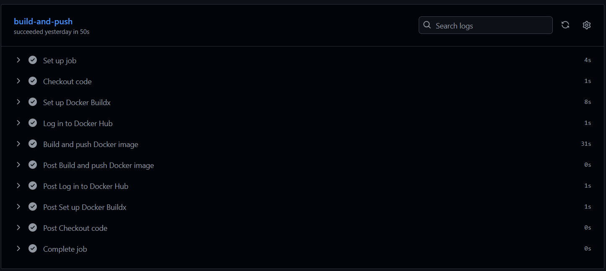
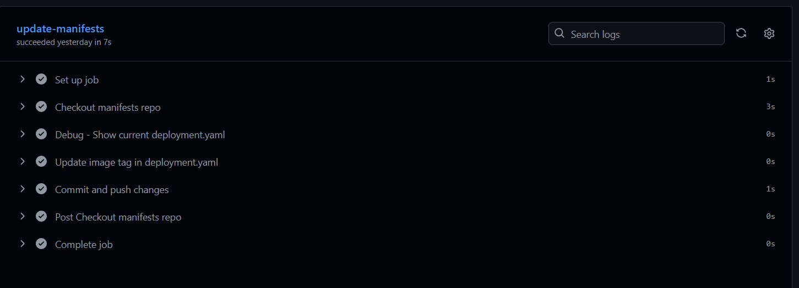
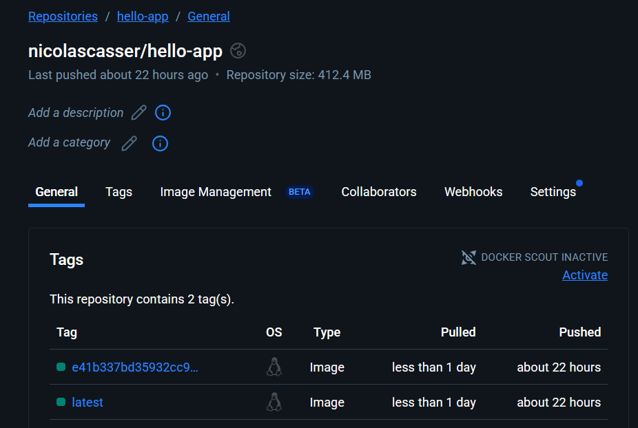
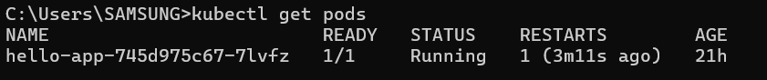
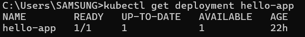
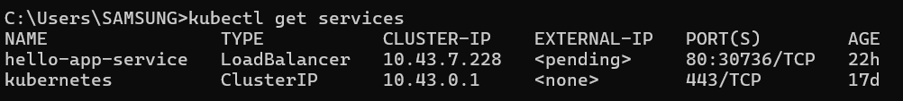
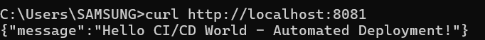
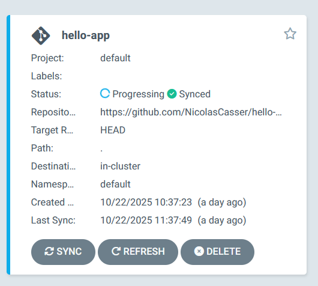

# Implementação de Pipeline CI/CD com GitHub Actions e GitOps

## 1. Visão Geral do Projeto

Este
 documento detalha a implementação de um pipeline completo de CI/CD 
(Integração e Entrega Contínuas) para uma aplicação FastAPI. O objetivo 
foi estabelecer um fluxo de trabalho automatizado que integra 
desenvolvimento, containerização, registro de imagens e deployment 
seguindo a metodologia GitOps.

## 2. Ferramentas e Conceitos-Chave

- **FastAPI:** Framework moderno para construção de APIs em Python.
- **Docker:** Plataforma para containerização de aplicações.
- **GitHub Actions:** Sistema de CI/CD integrado ao GitHub para automação de workflows.
- **GitOps:** Metodologia onde o repositório Git serve como fonte da verdade para infraestrutura e deployments.
- **Kubernetes:** Orquestrador de containers para deployment da aplicação.
- **ArgoCD:** Ferramenta de GitOps que sincroniza automaticamente o cluster Kubernetes com o estado definido no Git.
- **Rancher Desktop:** Solução para execução de cluster Kubernetes local.

## 3. Fases do Projeto

### Fase 1: Preparação do Ambiente e Criação dos Repositórios

- **Objetivo:** Configurar o ambiente de desenvolvimento local e criar a estrutura de repositórios necessária para o fluxo GitOps.
- **Processo:**
    1. **Configuração do Kubernetes Local:** O Rancher Desktop foi instalado e configurado com Kubernetes habilitado. A conectividade foi verificada através do comando `kubectl get nodes`.
    2. **Instalação do ArgoCD:** O ArgoCD foi instalado no cluster local através do manifesto oficial, criando o namespace `argocd` e aplicando os recursos necessários.
    3. **Criação dos Repositórios:** Dois repositórios GitHub foram criados:
        - `hello-app`: Contém o código fonte da aplicação FastAPI e o pipeline CI/CD
        - `hello-manifests`: Armazena os manifests Kubernetes para deployment
- **Resultado:** Ambiente Kubernetes funcional com ArgoCD instalado e estrutura de repositórios preparada para implementação do fluxo GitOps.

### Fase 2: Desenvolvimento da Aplicação FastAPI

- **Objetivo:** Criar uma aplicação web simples com endpoints para teste e health checks.
- **Processo:**
    1. **Implementação da Aplicação:** Foi desenvolvido o arquivo `main.py` com uma aplicação FastAPI contendo dois endpoints:
        - `/`: Retorna mensagem de boas-vindas
        - `/health`: Fornece status para health checks do Kubernetes
    2. **Containerização:** Foi criado o `Dockerfile` para empacotar a aplicação, utilizando Python 3.9 como imagem base e configurando a exposição na porta 8000.
    3. **Gerenciamento de Dependências:** Foram especificadas as dependências no `requirements.txt` com versões fixas para garantir reproducibilidade.
- **Código da Aplicação (main.py):**

```python
from fastapi import FastAPI

app = FastAPI()

@app.get("/")
async def root():
    return {"message": "Hello CI/CD World - Automated Deployment!"}

@app.get("/health")
async def health():
    return {"status": "healthy"}
```

- **Resultado:** Aplicação FastAPI funcional e containerizada, pronta para integração com o pipeline CI/CD.

### Fase 1: Preparação do Ambiente e Criação dos Repositórios

- **Objetivo:** Configurar o ambiente de desenvolvimento local e criar a estrutura de repositórios necessária para o fluxo GitOps.
- **Processo:**
    1. **Configuração do Kubernetes Local:** O Rancher Desktop foi instalado e configurado com Kubernetes habilitado. A conectividade foi verificada através do comando `kubectl get nodes`.
    2. **Instalação do ArgoCD:** O ArgoCD foi instalado no cluster local através do manifesto oficial, criando o namespace `argocd` e aplicando os recursos necessários.
    3. **Criação dos Repositórios:** Dois repositórios GitHub foram criados:
        - `hello-app`: Contém o código fonte da aplicação FastAPI e o pipeline CI/CD
        - `hello-manifests`: Armazena os manifests Kubernetes para deployment
- **Resultado:** Ambiente Kubernetes funcional com ArgoCD instalado e estrutura de repositórios preparada para implementação do fluxo GitOps.

### Fase 2: Desenvolvimento da Aplicação FastAPI

- **Objetivo:** Criar uma aplicação web simples com endpoints para teste e health checks.
- **Processo:**
    1. **Implementação da Aplicação:** Foi desenvolvido o arquivo `main.py` com uma aplicação FastAPI contendo dois endpoints:
        - `/`: Retorna mensagem de boas-vindas
        - `/health`: Fornece status para health checks do Kubernetes
    2. **Containerização:** Foi criado o `Dockerfile` para empacotar a aplicação, utilizando Python 3.9 como imagem base e configurando a exposição na porta 8000.
    3. **Gerenciamento de Dependências:** Foram especificadas as dependências no `requirements.txt` com versões fixas para garantir reproducibilidade.

### Fase 3: Configuração do Pipeline CI/CD com GitHub Actions

- **Objetivo:** Implementar automação completa para build, teste e publicação de imagens Docker.
- **Processo:**
    1. **Configuração de Secrets:** Foram criadas três secrets no repositório `hello-app`:
        - `DOCKER_USERNAME`: Usuário do Docker Hub
        - `DOCKER_PASSWORD`: Token de acesso gerado no Docker Hub
        - `GH_PAT`: Personal Access Token do GitHub com permissões de repositório
    2. **Implementação do Workflow:** Foi desenvolvido o arquivo `.github/workflows/ci-cd.yml` com dois jobs sequenciais:
        - `build-and-push`: Responsável por construir e publicar a imagem Docker
        - `update-manifests`: Atualiza automaticamente os manifests Kubernetes
- **Workflow GitHub Actions (ci-cd.yml):**

```yaml
name: CI/CD Pipeline
on:
  push:
    branches: [ main ]
jobs:
  build-and-push:
    runs-on: ubuntu-latest
    steps:
    - name: Checkout code
      uses: actions/checkout@v4
    - name: Set up Docker Buildx
      uses: docker/setup-buildx-action@v3
    - name: Log in to Docker Hub
      uses: docker/login-action@v3
      with:
        username: ${{ secrets.DOCKER_USERNAME }}
        password: ${{ secrets.DOCKER_PASSWORD }}
    - name: Build and push Docker image
      uses: docker/build-push-action@v5
      with:
        context: .
        push: true
        tags: |
          ${{ secrets.DOCKER_USERNAME }}/hello-app:latest
          ${{ secrets.DOCKER_USERNAME }}/hello-app:${{ github.sha }}

  update-manifests:
    runs-on: ubuntu-latest
    needs: build-and-push
    steps:
    - name: Checkout manifests repo
      uses: actions/checkout@v4
      with:
        repository: ${{ github.actor }}/hello-manifests
        token: ${{ secrets.GH_PAT }}
        path: manifests
    - name: Update image tag in deployment.yaml
      run: |
        cd manifests
        sed -i 's|nicolascasser/hello-app:.*|${{ secrets.DOCKER_USERNAME }}/hello-app:${{ github.sha }}|g' deployment.yaml
    - name: Commit and push changes
      run: |
        cd manifests
        git config user.name "github-actions"
        git config user.email "github-actions@github.com"
        git add .
        git commit -m "CI: Update image to ${{ github.sha }}"
        git push
```

- **Resultado:** Pipeline CI/CD totalmente funcional que automatiza o processo desde o commit até a atualização dos manifests.

### Fase 4: Configuração dos Manifests Kubernetes

- **Objetivo:** Definir os recursos Kubernetes necessários para o deployment da aplicação.
- **Processo:**
    1. **Criação do Deployment:** Foi desenvolvido o arquivo `deployment.yaml` contendo a configuração do deployment da aplicação, incluindo:
        - Especificação da imagem Docker a ser utilizada
        - Configuração de health checks através do endpoint `/health`
        - Definição de réplicas e recursos
    2. **Criação do Service:** Foi criado o arquivo `service.yaml` para expor a aplicação:
        - Configuração do tipo LoadBalancer
        - Mapeamento da porta 80 para porta 8000 do container
- **Resultado:** Manifests Kubernetes completos e versionados no repositório `hello-manifests`.

### Fase 5: Configuração da Aplicação no ArgoCD

- **Objetivo:** Estabelecer a conexão entre o repositório Git e o cluster Kubernetes através do ArgoCD.
- **Processo:**
    1. **Acesso ao ArgoCD:** Foi realizado o port-forward do serviço do ArgoCD para acesso à interface web:

```bash
kubectl port-forward svc/argocd-server -n argocd 8080:443
```

**Obtenção de Credenciais:** A senha administrativa foi recuperada através do comando:

```bash
kubectl -n argocd get secret argocd-initial-admin-secret -o jsonpath="{.data.password}" | base64 -d
```

1. **Criação da Aplicação:** Na interface web do ArgoCD, foi criada uma nova aplicação com os seguintes parâmetros:
    - **Application Name:** `hello-app`
    - **Project:** `default`
    - **Sync Policy:** `Automated` (habilitando sincronização automática)
    - **Repository URL:** URL do repositório `hello-manifests`
    - **Path:** `.` (diretório raiz do repositório)
    - **Cluster URL:** `https://kubernetes.default.svc`
    - **Namespace:** `default`
- **Resultado:** Aplicação configurada no ArgoCD para monitorar automaticamente o repositório `hello-manifests` e sincronizar o estado do cluster Kubernetes.

### Fase 6: Validação do Fluxo Completo

- **Objetivo:** Testar todo o pipeline desde a alteração do código até o deployment final.
- **Processo:**
    1. **Alteração do Código:** Foi modificada a mensagem no endpoint principal da aplicação para validar o funcionamento do pipeline.
    2. **Commit e Push:** As alterações foram commitadas e pushed para o repositório `hello-app`.
    3. **Monitoramento:** Todo o fluxo foi monitorado passo a passo:
        - Execução do GitHub Actions
        - Build e push da nova imagem Docker
        - Atualização automática do repositório `hello-manifests`
        - Sincronização automática pelo ArgoCD
        - Deployment da nova versão no Kubernetes
- **Resultado:** Fluxo completo validado com sucesso, demonstrando a automatização total do processo de desenvolvimento até produção.

## 4. Resultados e Evidências

- **Pipeline GitHub Actions Executando com Sucesso**




- **Imagens Publicadas no Docker Hub**


- **Aplicação Rodando no Kubernetes**






- **Acesso à Aplicação Funcionando**



- **ArgoCD Sincronizado**
  

    

## 5. Conclusão

O projeto demonstrou com sucesso a implementação de um pipeline CI/CD 
completo integrado com práticas GitOps. A automação estabelecida permite
 que desenvolvedores foquem no código, enquanto o sistema gerencia 
automaticamente todo o processo desde o commit até o deployment em 
produção, garantindo consistência, rastreabilidade e confiabilidade.
